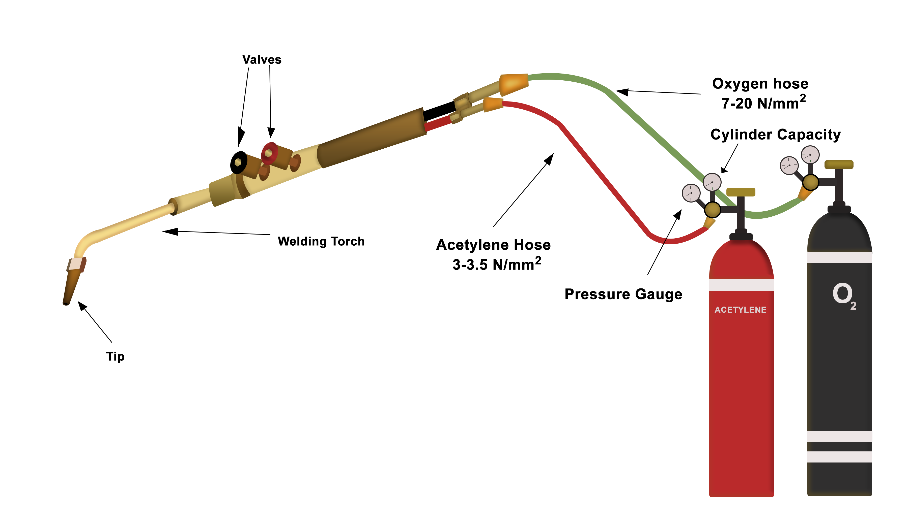
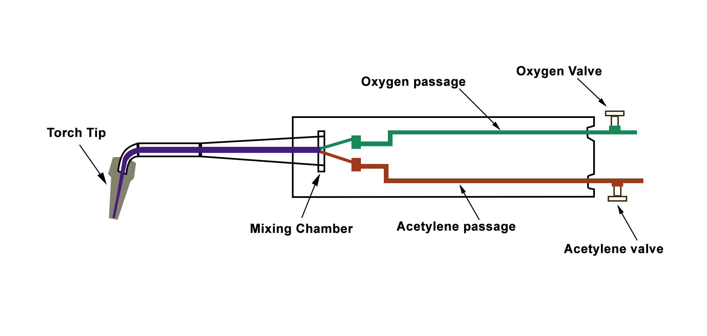
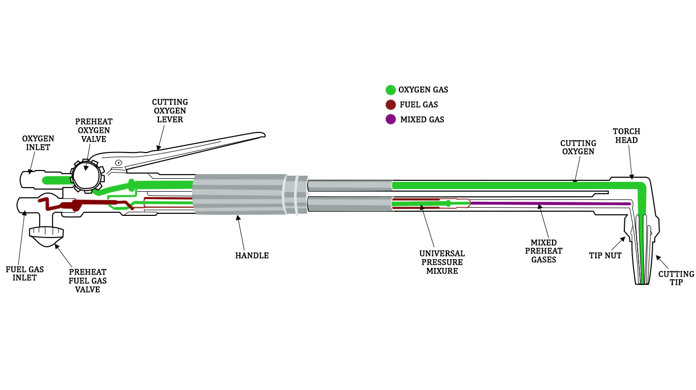

# Introduction:

This experiment will focus on gas welding and the gas-cutting process. Gas welding and gas cutting are metal-welding and metal-cutting processes that use acetylene as fuel gas along with oxygen. By using pure oxygen and fuel/gas, oxy-fuel welding joins metals such as alloy steels, carbon steel, aluminium, magnesium, and cast iron. Oxy-acetylene cutting is a type of thermal cutting that involves cutting materials with combustible gas (like MAPP, natural gas, propylene, and acetylene gas) and oxygen. Fig.1 below shows the setup of the Oxy-fuel welding.

#### Fig.1. Oxyacetylene welding setup

 

# Theory:
## (i) Gas welding
Oxy-fuel welding, popularly known as "Gas Welding," is a heat-generating method that uses the combustion of oxygen and fuel. Proper oxygen and fuel ratio is passed through a hand-held torch to form a flame that is extremely hot measuring approximately 3200°C. Many fuel gas can be utilized in oxy-fuel welding such as propane, methane, hydrogen etc. However, an oxygen-acetylene mixture is the most common. By altering the volume ratio of oxygen to acetylene via the torch or blowpipe nozzles, the oxyacetylene flame's chemical reaction can be adjusted. 

The schematic diagram of the parts of a gas welding setup is shown in Fig. 2 below.
 

#### Fig.2.  Gas welding process

 

##(ii) Gas cutting 
The oxy-fuel process of cutting is entirely different from welding. In oxygen-fuel cutting, metal is heated to a red-hot temperature using an oxy-acetylene flame. This is followed by a delivery of a jet of pure oxygen that undergoes an exothermic reaction with the heated metal by oxidation. The high heat produced thus melts the base metal and causes a through hole that forms a cut. Since oxidation is used to achieve this, only metals that readily oxidize at a high temperature can undergo such oxy-fuel cutting. These metals include low alloy steel and mild steel. Fig.3 below shows the schematic of the gas-cutting process.

#### Fig.3. Gas-cutting process

 

***Gas welding process chemistry:***

C2H2 is the most commonly used welding fuel. It dissociates in the presence of oxygen in the first step of the two-stage process, releasing hydrogen gas, carbon monoxide, and heat.

O2+ C2H2 = H2 + 2CO + Heat…………. (i)

Following that, Carbon monoxide, hydrogen, and more oxygen mix in a secondary process to create water vapour and carbon dioxide.

2CO + H2 + 1.5O2 = H2O + 2CO2 + Heat……… (ii)

Combining equations (i) and (ii) above shows that one part of acetylene requires roughly two and a half parts of oxygen for the process.

2.5O2 + C2H2 = H2O + 2CO2 + Heat…………. (iii)

A welder can produce any desired flame condition and temperature by adjusting the relative proportions of acetylene and oxygen.

## Different Welding Gases.

Industrial fuel gases have the need for oxygen to enable combustion. Hence, these fuel gas must have the following properties when burned with oxygen in order to be suitable for welding operations. 

1.	high-temperature flame 
2.	greater heat propagation rate
3.	sufficient content of heat (Enthalpy)

### Acetylene
 
Acetylene most closely satisfies all of the above criteria amid the readily available fuel gases in industry, including C3H8, hydrogen, natural gas, propylene, liquefied petroleum gas (LPG) hydrogen, and MAPP gas.

#### Acetylene Characteristics:
1.	A fundamental ignition region and a subsidiary ignition region are the two stages in which hydrocarbons burn (envelope flame). 
2.	When mixed with oxygen, the colorless gas acetylene produces an extremely combustible mixture. 
3.	A combination of calcium carbide and water produces acetylene gas, which has the chemical formula C2H2 and is made up of carbon and hydrogen.

The other two cutting and joining gases are 
- Hydrogen
- MAPP

#### MAPP

MAPP is a blend of methylacetylene-propadiene and LPG (acetylene and propane). MAPP gas can be used in high-volume acetylene cutting torches capable of cutting steel up to 12 inches thick, at pressures which are substantially greater than those of acetylene, frequently reaching pressures of 40 or 50 psi.

#### Hydrogen 

It generates low-temperature flames and is compatible with aluminium. Since non-luminous hydrogen flames may be utilized at higher pressures than acetylene, they are widely used for underwater welding.

Gases that are good for cutting yet inappropriate for welding are as follows: 
- Methane 
- Propane
- Liquified Petroleum Gas

Due to their oxidizing properties, hydrocarbon gases, including propane, natural gas, butane, municipal gas, and others, are not suitable for welding iron or steel.

## Gas Welding Equipment:

1.	***Oxygen cylinder:*** It is a hollow, closed cylinder that can withstand extremely high pressures, and it is attached to a safety valve and regulator.  Steel cylinders with capacities ranging from 2.25 to 6.3 m3 are used. At 21°C, the cylinders are filled with oxygen at a density of roughly 150 kg/cm2. The knob that operates the valve can open or close the cylinder. To secure the nozzle, a protective cover is provided on the cylinder's top. Fig. 4 below shows a schematic of an oxygen cylinder.

#### Fig.4a. Oxygen cylinder           

 

  

#### Fig.4b. Cross-section of an oxygen cylinder

 

2.	***Acetylene cylinder:*** Similar to oxygen cylinders steel is used to make acetylene cylinders. The acetylene cylinder can be filled to a pressure of 18 to 20 kg/cm2. The cylinder has a capacity of around 10m3. The safety valve and regulator valve are mounted on the cylinder. Since acetylene is relatively unstable when compressed in free space, the cylinder is not hollow. The cylinder contains porous material that has been saturated with liquid acetone (in a similar manner to a sponge absorbing water). Acetylene gas is injected into the cylinder, where it is absorbed by the soluble acetone (acetone can absorb acetylene many times its volume). Fig. 5a and 5b below shows the schematic representation of the acetylene cylinder and its cross-section.

#### Fig.5a. Acetylene cylinder               

 

#### Fig.5b. Cross-section of an acetylene cylinder

 

3.	***Gas welding torch:*** Welding is done with a welding torch. It is identified by the presence of only one or two pipes leading to the nozzle and the operator can regulate the flow of oxygen and fuel using the two valve controls located at the handle's base, respectively. Fig.6 below shows the simplified construction of a welding torch.

#### Fig.6. Gas welding torch construction

 
 

4.  ***Gas-cutting torch:*** Fig.7 below shows a longitudinal cross-section of a gas-cutting torch. A jet of oxygen that cuts the metal emerges through a wider centre aperture in the cutting torch's tip. The oxygen-acetylene mixture needed for pre-heating is supplied through a collection of orifices that surround the centre aperture. Two high-pressure valves that control oxygen and acetylene flow to provide a neutral preheating flame is included with the cutting torch. After preheating, a mechanical lever is pulled to release a high-pressure oxygen jet from the central aperture. The diameter of the central aperture of the gas-cutting torch varies with the variation of the thickness of the workpiece.   

#### Fig.7.  Gas-cutting torch cross-sectional view

 

## Types of Gas Flames

a.	***Oxidizing Flame:*** An oxidizing flame is formed when the amount of oxygen gas in the torch is greater than the amount of acetylene (ratio of around 2:1) that has been added. The oxidizing flame is divided into two zones: the inner zone, which is very bright white and has a temperature of around 3300°C, and the blue outer zone of lower temperature. This flame is used to cut and weld metals that are not much affected by oxidation, including brass, copper, bronze alloys, etc. Fig.8 below is a schematic representation of an oxidizing flame. 

#### Fig.8. Oxidizing flame representation

 

b.	***Carburizing Flame:*** A carburizing flame forms when there is more acetylene in the mixture than oxygen (the ratio of around 2:1). This flame has three zones, a bright luminous inner zone, an intermediate acetylene feather, and an outer blue envelope. This flame is used to weld metals like Nickel alloys and Monel. Fig.9 below shows the schematic representation of carburizing flame. 

#### Fig.9. Carburizing flame representation

 

c.	***Neutral flame:*** It is characterized as a balanced flame. Equal parts of the gases oxygen and acetylene (1:1 ratio) are combined. It is divided into two structural zones: the outer enclosure and the inner cone. It features a well-defined inner cone signifying complete combustion. The outer envelope of a neutral flame is wider as compared to the narrow outer envelope of oxidizing flame. A neutral flame is the most commonly used flame type, typically used for welding steel, cast iron, and other metals. Fig.10 below shows the schematic of the neutral flame

#### Fig.10. Neutral flame representation

 

 
## Applications:

Sheet metal work makes extensive use of oxy-acetylene welding. With the correct filler metals, all metals can be welded. For cutting application only the cutting torch, replaces the welding torch, rest all the equipment are the same. 

## Advantages:
1.	When compared to other welding processes, the equipment is less expensive. 
2.	It is suitable for the welding of all metals. 
3.	Equipment maintenance is simple. 
4.	It can be used to cut thin metals. 
5.	It can be easily carried to remote places.

##  Disadvantages:
1.	Compared to arc welding, it takes a substantial amount of time to heat the job.
2.	This process may lead to brittleness and prone to corrosion. 
3.	Gases are expensive and complicated to store.